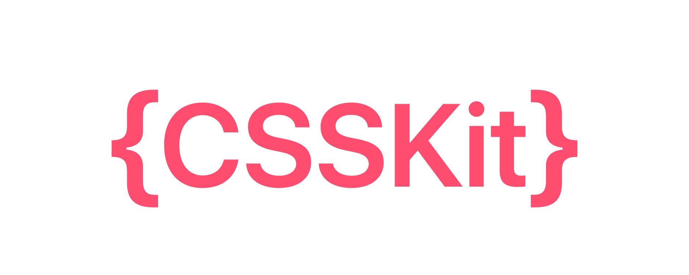

<p align="center">
  
</p>

CSS DSL written in Swift.

> Draft readme

### Styles support

For now it has only direct support for styles

```swift
Style.display(.flex)
Style.position(.absolute)
// etc.
```

Almost all keys for styles are already here, but factories for values are still in development, anyway you can use strings for initialization for now

```swift
Style.margin("10pt")
```

Transform functions are implemented btw :)

```swift
Style.transform(.translate(x: 10%))

// Or you can create custom ones like so

extension Style.TransformFunction {
    func someNew3DFunction(
        x: Dimension.Length, 
        y: Dimension.Length, 
        z: Dimension.Length
    ) -> Self {
        Style.TransformFunction(
            name: "someNew3DFunction",
            arguments: [
              	x.erased,
                y.erased,
                z.erased
            ]
        )
    }
}
```

Use StylesCollections for elements

```swift
let styles: StylesCollection = [ // the same as `let styles: [Style] = [...`
    .alignSelf(.center),
    .background(Color.brown.hex(uppercase: true, hashTagPrefix: true)),
    .borderRadius(1.in.px.render())
]
styles.render() // "align-self:center;background:#A52A2AFF;border-radius:1.0px;"
```

### Dimensions

Dimensions are present but not integrated in styles factory, so u can render them manually for now

```swift
Style.margin(10.in.pt.render())
// the same as
Style.margin(Dimension.Length(value: 10, unit: .pt).render())
// or
Style.margin(Dimension.Length.pt(10)).render())
//  Need for `render()` call will be removed in beta releases (It's currently alpha)
```

Also you can convert some dimensions or replace units

```swift
// - Convert
1000.in.ms // 1000 ms
1.in.s.converted(to: .ms) // 1000 ms

1.in.kHz // 1kHz
1000.in.hz.converted(to: .kHz) // 1kHz

// - Replace units
1.in.s.in(.ms) // 1ms
1.in.s.value.in.pt // 1pt

// - Other
10% // Dimension.Length(value: 10, unit: .percent) or 10.in.percent
```

Corneres & Edges are supported too

### Colors

See [GenericColor](https://github.com/MakeupStudio/GenericColor) and [Palette](https://github.com/MakeupStudio/Palette) for more.

```swift
Style.background(color: .livingCoral)
Style.foreground(color: .hex("ffffff")!)
```

### Fonts

I'm gonna provide a static factory for google fonts later, and Font type behaviour may change.

```swift
Style.fontFamily("arial")
Style.fontSize(.pt(10))
Style.fontWeight(.bold)
```

### Installation

```swift
.package(
    url: "https://github.com/MakeupStudio/CSSKit.git", 
    .upToNextMajor(from: "1.0.0-alpha.1.0")
)
```

### Integration

You can use `generateIntegration` methods from CSSKit itself by passing needed arguments or use **[this](https://makeupstudio.herokuapp.com/CSSKit)** tool for autogenerating integration code.

So it will generate all the needed fields for your container type, for example for HTML type it will look like

```swift
// MARK: - Implementation

extension HTML {

    internal func appendingStyle(_ style: Style) -> Self {
        <#Implementation#>
    }

}

// MARK: - Generated

extension HTML {
    
    public func alignContent(_ value: String) -> Self {
        appendingStyle(.alignContent(value))
    }

    public func alignItems(_ value: String) -> Self {
        appendingStyle(.alignItems(value))
    }
  
  	// ...
  
}
```

And you'll be able to use chaining like this

```swift
someHTMLInstance
    .display(.flex)
    .transform(.rotate(x: .deg(30)))
```

---

_Hopefully I'll add more typo-free static factories & extend fonts support a bit next week_

_Feel free to open issues if you need any functionality_